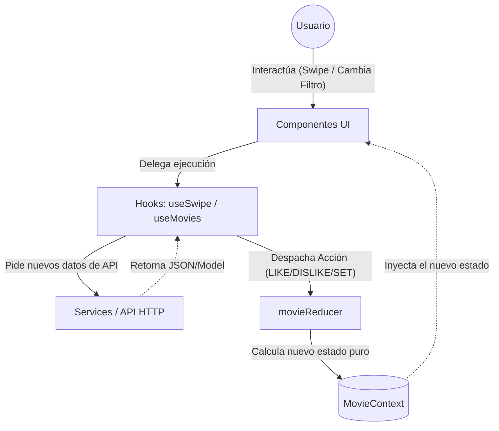

# Arquitectura de CineSwipe

Este documento detalla la estructura y arquitectura de la aplicación web CineSwipe, construida con React 18, Vite, TypeScript y Tailwind CSS, apoyada únicamente en React Context + useReducer para el manejo de estado.

## 1. Estructura de Directorios

```text
src/
├── assets/
│   └── images/         # Recursos estáticos locales
├── components/
│   ├── common/         # Componentes UI reutilizables (Botones, Loaders, Layouts)
│   ├── movies/         # Componentes representacionales de películas (Deck, Cards)
│   └── search/         # Componentes representacionales para filtros y búsqueda
├── context/
│   ├── movies/         # Estado global (Context) y mutaciones (useReducer)
│   └── theme/          # Estado de modo claro/oscuro (opcional)
├── hooks/
│   ├── movies/         # Lógica de negocio separada de UI (useSwipe, useMovies)
│   └── shared/         # Hooks genéricos (useDebounce)
├── services/
│   └── api/            # Abstracciones para llamadas HTTP (ej. fetch API)
├── types/
│   └── index.ts        # Interfaces globales compartidas (Movie, AppState)
├── App.tsx             # Árbol principal, inyección de Proveedores (Context)
└── main.tsx            # Punto de montaje principal de Vite
```

## 2. Definición de Módulos y Responsabilidades

| Módulo / Carpeta | Responsabilidad | Archivos Clave |
|------------------|-----------------|----------------|
| `components/movies` | Renderizar tarjetas con Tailwind. Capturar gestos/swipes delegando la física y resolución a los Hooks. No maneja estados pesados. | `SwipeDeck.tsx`, `MovieCard.tsx` |
| `components/search` | UI de filtros (genero, año) y barras de entrada. Envían la intención de interacción visual a los hooks. | `FilterBar.tsx` |
| `context/movies` | Ser la fuente única de verdad para el sistema (Single Source of truth). Almacena el feed activo, lista de "Likes", "Dislikes". | `MovieContext.tsx`, `movieReducer.ts` |
| `hooks/movies` | Aisla la lógica (Business Logic). `useSwipe` captura métricas y coordenadas, evaluando si es Right (Like) o Left (Dislike). Despacha al Context. | `useSwipe.ts`, `useMovies.ts` |
| `services/api` | Exclusiva la comunicación hacia el Backend / API externa (ej. TMDB), devolviendo los datos tipados con sus interfaces de TypeScript. | `movieClient.ts` |

## 3. Flujo de Datos Arquitectónico


